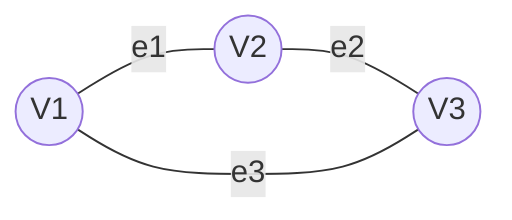
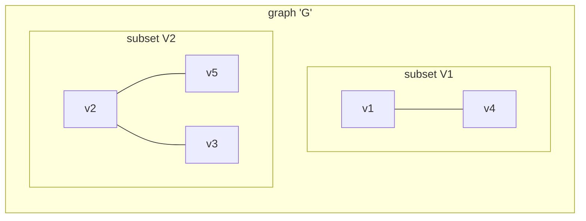

# Graphs

A graph is a mathematical structure that relation a set of entities called `Vertex` and its connections called `Edges`. A graph is represented as:
$$
G = (V, E)
$$
Or visually:

Where $V_n$ are the vertex in the set $V$, and the $e_n$ are the edges in the set $E$ of the graph.
```ad-note
A graph can be classified as **_directed_** of **_undirected_** graph
```
#### Weighted Graph
A weighted graph is a graph in which each edge has a `value`, that `value` is called `weight`, mostly represent the cost to 'do something' from the vertex $V_a$  to the vertex $V_b$.

#### Complete Graph
A complete graph of $n$ if often represented as $K_n$ , this graph is `connected` and meet the next requirements:
- $\forall v_x\in V \space  \delta(v_x) = n-1$
- $|E| = {n(n-1)}/{2}$

#### Bipartite Graph
A graph is bipartite if exists 2 sets $V_1$ and $V_2$ , that:
- $V_1 \cap V_2 = \emptyset$
- $V_1 \cup V_2 = V$ 
- if an edge is described as $e_k <- (v_0, v_f)$ , then $v_0$ and $v_f$ cannot be in the same set.

##### Complete Bipartite Graph
 Is represented as $K_{m,n}$ , where the vertex are partitioned into a set $V_1$ with $m$ vertex and a set $V_2$ with $n$ vertex, in which the `edge set` consist of a tuple of  $(v_1, v_2)$ where $v_1 \in V_1$ and $v_2 \in V_2$.

 
## Paths and cycles
A path is the sequence of vertex from $v_0$ to $v_n$ , of a length $n$.
$$
(v_0, e_1, v_1, e_2, v_2, e_3, v_3, ..., e_n, v_n)
$$
In which each edge is incident on vertices $v_{i-1}$ and $v_i$ for $i = 1, ..., n$ 
