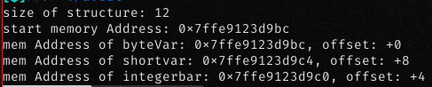

# 4. Memory Management
Because C is a semi low-level language, the job of free/allocate memory is needed to be written explicitly by the developer, due there is nothing like a Garbage Collector, from high level language.

## Pointers
The pointers are the most crazy things in C, this is a 'type' but really is a `long int` variable with information, why? because a pointer is a memory direction, and a memory direction has the same length as a cpu register, thats why i call it a `long int`, and by context is the meaning and the type that is stored in that memory address.

Usually the syntax is the `type *variable`
as i said, a pointer always is the same length as `long int`, but its  a memory addres so, the sign doesnt has sense, due this a posible value is `0x001a202c45fa`, and the context is that the type that could be write/read into that addres is `type`.

when a pointer is defined as `void *var`
this means that the pointer is a generic pointer, this could be called 'Generalization' with generic types like we can see in language like Java, this pointer can be casted to any type, but make sure that address is correctly bounded (this means is that we want to write a int value in a char pointer, we can have an error due differ lengths).

### Visualization of a memory block
|Memory address |   0x00    |  .......   | 0x001a202c45fa |    .....   |
| :------       | :----:    |  :-----:   |    :------:    |  :------:  |
|   Content     | \<1-Byte\>| \<1-Byte\> |   \<1-Byte\>   | \<1-Byte\> |

#### Accessing to pointer value
To get/set a value stored in the memory address of the pointer, we only to preced the pointer variable with a `*` like:
`some_var = *ptr;` This would get the value stored on the mem address.
`*ptr = <value>;` This will write the specific `<value>` in the memory address that the pointer has.

##### Issues with pointers
Accessing (get) the pointer value is something that can be _'not harmful'_ but, accessing to an uninitialized memory address would raise an error like `heap overflow error`, or can lead to undefined behaviours.

Writting something into pointer is the most **harmful** action in c, we need to be so carefull when writting something, that we cannot write in the `NULL` pointer due is a reserved memory space. Writting into a random/ free memory address would lead to undesired `undefined behaviours`.


## Memory Allocation
As we mention earlier, the Head region contains the dynamic memory, but how we allocate dynamic memory?
well in the  **Standard C library** we have some functions for allocation, the most commont are **malloc** and **calloc**, malloc allocates memory without zero-ing the values (this may vary due a kernel configuration), and calloc always zero the allocated memory, by that calloc is 'slower' than malloc.
If an error, or cannot allocate memory, the functions return a **NULL** pointer.

##### **Note:**
To use allocators you need to include the `stdlib.h` header.
Most common used memory allocators are:
- `malloc(<total_bytes>)` this will allocate a contiguous memory but with garbage values stores in it.
- `calloc(<n_blocks>, <block_size_bytes>)` calloc is a special function that do more than ensure zeroing memory block allocation, you can see more about this at [this stackOverflow post](https://stackoverflow.com/questions/4083916/two-arguments-to-calloc) . In the `<block_size_bytes>` we usually send the `sizeof(<type>)` of the type we want to allocate, and the total bytes we allocate always is  `<n> * <block_size_bytes>`.
- `realloc(<pointer>, <new_size>)` This allocator 'add' more memory to the pointer, in reallity it free previous pointer and copy its data to the new size memory, the pointer that we send will be free so ensure to not use anymore.

For detailed documentation see `man 3 malloc`

## Memory Freeing
So we allocate memory, but... if i don't need anymore that?
our **Standard C library** not only allow to us to allocate memory, also let us free it, and the name of that function is so hard to remember, we need to only call **free(\<pointer\>)**. Letting jokes aside, this function doesn't free the memory at the time its called, it notify to the kernel to schedule the freeing.
It's recommended to avoid any modification to the previous freed memory, due this could lead to **Undefined Behaviours**.

## Memory Aligment // TODO
When we are allocating memory, usually an allocator function would allocate a little bit more memory for metadata of the pointer, and if the desired size is different than a multiple of n-bytes, where n is a power of 2, the allocator would round the size to the next power of 2

## Memory Padding 
When we are defining a structure, or a union, the compiler would add padding to avoid calculate the offset for each member, supose you have the next structure defined in your code:
```c
struct myData {
	char byteVar;    // This member would use 1 byte on memory
	short shortvar;  // This member would use 2 bytes on memory
	int intergetvar; // This member would use 4 bytes on memory
};
```
Now as we see above, all the members declared in the struct, has different size so to make the code more optimized the compilers compute a padding to avoid calculations while accessing members.
The padding is calculated as:
```
padding = (align - (offset mod align)) mod align
```
The padding is dependent on architecture due a processor can only read 1 `word` of memory at a time, in x86_64 the `word` size if `8-bytes` so the structure member should aling to a `word` size.
Thre previous Structure after padding would be aligned to:
```c 
struct myData {
	char byteVar;
	char padding[1]; // This is added internally, cannot access
	short shortvar;
	int integervar;
};
```
The previous aparenting size of the structure were `7 bytes` , but it was padding to `8 bytes`.


Another thing is that the order of the members affect to the struct size, if we change the previous structure to:
```c
struct myData {
	char bytevar;
	int intvar;
	short shortvar;
};
```
If we compile this the structure would be padding to:
```c
struct myData {
	char bytevar;
	char padding[3];
	int intvar;
	char padding[2];
	short shortvar;
};
```
as we see there is more padding due an innefficient order of members:

